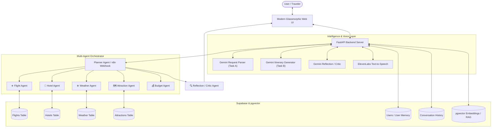

# 🌴 Multi-Agent AI Vacation Planner

An end-to-end agentic AI vacation planning platform that orchestrates specialized AI agents (**Flight Agent**, **Hotel Agent**, **Weather Agent**, **Attraction Agent**, **Budget Agent**, and **Reflection / Critic Agent**) coordinated by a central **Planner Agent**. Built on **Supabase** (Postgres + pgvector RAG), **n8n orchestration**, **Google Gemini LLM**, and **ElevenLabs text-to-speech voice narration**.

---

## 📐 System Architecture



---

## 🤖 Multi-Agent Roles & Specialization

| Agent | Responsibility | Primary Input | Output |
| :--- | :--- | :--- | :--- |
| **✈️ Flight Agent** | Queries, filters, and ranks domestic flights | `destination`, `sort_by` (`price`/`duration`) | Top 5 ranked flights |
| **🏨 Hotel Agent** | Filters accommodations by rating and budget constraints | `city`, `budget` (per night), `min_rating` | Top 5 ranked hotels |
| **☀️ Weather Agent** | Retrieves seasonal temperature, rainfall, and humidity | `destination` | Climate record & packing tips |
| **🗺️ Attraction Agent** | Curates sightseeing spots, categories, timings, and ticket costs | `destination` | Top 5 attractions with entry fees |
| **💰 Budget Agent** | Evaluates $\text{Total} = \text{Flights} + \text{Hotels} + \text{Food} + \text{Taxi} + \text{Activities}$ | Line item costs | Total budget & surplus/deficit summary |
| **🧭 Planner Agent** | Master orchestrator coordinating all specialized agents | Parsed travel constraints | Consolidated multi-agent travel context |
| **🔍 Reflection Agent** | Quality inspection layer validating budget math and feasibility | Itinerary draft, constraints, totals | Critic Score (0-100), warnings, suggestions |

> [!IMPORTANT]
> **No Restaurant Agent**: Per system specifications, restaurant data is utilized exclusively as a food cost baseline inside the Budget Agent. There is no dedicated Restaurant Agent.

---

## 📂 Repository Structure

```
Vacation-Planner/
├── backend/                        # FastAPI Backend Application
│   ├── database/
│   │   ├── schema.sql              # Supabase & pgvector SQL schema migration
│   │   └── seed_data.py            # Automated CSV dataset & RAG seed script
│   ├── services/
│   │   ├── gemini_service.py       # Gemini Parser, Itinerary Generator & Embeddings
│   │   ├── n8n_service.py          # n8n Webhook & local multi-agent orchestrator
│   │   ├── supabase_service.py     # Supabase PostgREST & local data fallback engine
│   │   ├── elevenlabs_service.py   # ElevenLabs Text-to-Speech synthesizer
│   │   └── rag_service.py          # Semantic vector retrieval & destination Q&A
│   ├── tests/
│   │   └── test_planner.py         # 18 automated tests covering 12 core scenarios
│   ├── config.py                   # Environment settings loader
│   ├── models.py                   # Pydantic request/response schemas
│   └── main.py                     # FastAPI REST API endpoints
├── data/                           # Travel Datasets
│   ├── flights.csv                 # 10,600+ flight records
│   ├── hotels.csv                  # 1,100+ hotel records across Indian cities
│   ├── weather.csv                 # 1,000+ destination weather records
│   └── attractions.csv             # 1,000+ curated tourist attraction records
├── docs/                           # Methodology & Review Specifications
│   ├── vacation_planner_methodology.pdf
│   └── Vacation_Planner_Review2 (1).pdf
├── frontend/                       # Modern Glassmorphic Web Application
│   ├── index.html                  # Single-page interface with pipeline stepper
│   ├── styles.css                  # Responsive design system
│   └── app.js                      # Client state, markdown parser & audio player
├── n8n/                            # n8n Workflow JSONs
│   ├── Flight Agent.json           # Flight sub-workflow
│   ├── Hotel Agent.json            # Hotel sub-workflow
│   ├── Weather Agent.json          # Weather sub-workflow
│   ├── Attraction Agent.json       # Attraction sub-workflow
│   ├── Budget Agent.json           # Budget calculation sub-workflow
│   ├── Planner Agent.json          # Master orchestrator workflow
│   └── Reflection Agent.json       # Quality inspection & critic workflow
├── .env.example                    # Environment variable template
├── .gitignore                      # Security exclusions
├── requirements.txt                # Python dependencies
└── README.md                       # Comprehensive project documentation
```

---

## 🚀 Quickstart & Installation

### 1. Prerequisites
- **Python 3.10+**
- (Optional) **n8n instance** (self-hosted or n8n cloud)
- (Optional) **Supabase project** (cloud or local)

### 2. Clone & Install Dependencies
```bash
# Navigate to the project directory
cd Vacation-Planner

# Install Python requirements
pip install -r requirements.txt
```

### 3. Configure Environment Variables
Copy `.env.example` to `.env` and configure your API keys:
```bash
cp .env.example .env
```

Edit `.env`:
```ini
# Google Gemini API Key (Required for LLM parsing & itinerary generation)
GEMINI_API_KEY=your_gemini_api_key_here
GEMINI_MODEL=gemini-1.5-flash

# ElevenLabs API Key (Required for Voice TTS Narration)
ELEVENLABS_API_KEY=your_elevenlabs_api_key_here
ELEVENLABS_VOICE_ID=21m00Tcm4TlvDq8ikWAM

# Supabase Credentials (Optional: Leave blank to use built-in local CSV data engine)
SUPABASE_URL=https://your-project-ref.supabase.co
SUPABASE_KEY=your_supabase_anon_key_here

# n8n Webhook URL (Optional: Leave blank to use built-in local multi-agent orchestrator)
N8N_WEBHOOK_URL=
```

### 4. Run the Application
Start the FastAPI server:
```bash
python -m uvicorn backend.main:app --host 0.0.0.0 --port 8000 --reload
```

Open your browser and navigate to:
```
http://localhost:8000
```

---

## 🗄️ Supabase Database & pgvector Setup

If you wish to use a live Supabase database instead of the local CSV engine:

1. Log into your **Supabase Dashboard** and open the **SQL Editor**.
2. Open [`backend/database/schema.sql`](file:///c:/Users/SHANKAR/Desktop/Vacation-Planner/backend/database/schema.sql), paste the entire script, and click **Run**.
   - Enables `vector` extension.
   - Creates `Flights`, `Hotels`, `Weather`, `Attractions`, `Users`, `Conversation_History`, `Trips`, and `Embeddings` tables.
   - Creates the `match_travel_documents` cosine similarity search RPC function.
3. Seed data automatically by running:
   ```bash
   python -m backend.database.seed_data
   ```

---

## 🔄 n8n Multi-Agent Workflow Import

To run the multi-agent workflows inside your n8n workspace:

1. Open **n8n** in your browser.
2. Import workflows in the following dependency order (**Workflows $\rightarrow$ Import from File**):
   1. `n8n/Flight Agent.json`
   2. `n8n/Hotel Agent.json`
   3. `n8n/Weather Agent.json`
   4. `n8n/Attraction Agent.json`
   5. `n8n/Budget Agent.json`
   6. `n8n/Reflection Agent.json`
   7. `n8n/Planner Agent.json`
3. Configure your Supabase credentials inside the Supabase nodes.
4. Copy the Webhook URL from the Planner Agent and paste it into `.env` under `N8N_WEBHOOK_URL`.

*(Note: If n8n is offline or unreachable, the system automatically falls back to the in-process multi-agent orchestrator without interruption).*

---

## 🧪 Automated Testing

The repository includes an extensive test suite verifying all 12 core system requirements:

```bash
python -m pytest backend/tests/test_planner.py -v
```

### Verified Test Matrix:
1. `test_1_basic_trip_request`: Happy-path 5-day Goa vacation planning.
2. `test_2_budget_constrained_request`: Over-budget detection and savings suggestions.
3. `test_3_different_destinations`: Multi-city support (Bangalore, Cochin, Jaipur, Delhi).
4. `test_4_different_durations`: Duration scaling (3, 5, 7, and 10 days).
5. `test_5_missing_optional_preferences`: Default fallback handling.
6. `test_6_invalid_requests`: Input edge cases.
7. `test_7_n8n_fallback_path`: In-process agent execution when n8n is offline.
8. `test_8_gemini_fallback_path`: Deterministic heuristic parser and markdown template generator.
9. `test_9_elevenlabs_service`: Markdown speech text cleaner and TTS synthesis.
10. `test_10_rag_query_and_retrieval`: Semantic vector similarity search and destination Q&A.
11. `test_11_conversation_history`: History logging and query retrieval.
12. `test_12_user_memory_propagation`: Durable traveler profile preference merging.

---

## 🔒 Security & Best Practices

- **Zero Secret Leakage**: No API keys are embedded in frontend client code or committed to Git.
- **`.gitignore` Protected**: `.env` and local credential files are strictly excluded from source control.
- **Server-Side Proxying**: Gemini, ElevenLabs, and Supabase credentials operate strictly within the backend API layer.
- **Sanitized JSON**: Output serialization handles `NaN` and `null` values gracefully.

---

## 📊 Component Provenance

| Component | Status Before | Implementation Delivered |
| :--- | :--- | :--- |
| **Datasets (`data/`)** | CSV datasets present | Enhanced query engine, city alias matching, fallback regional flight generation |
| **n8n Workflows (`n8n/`)** | 6 JSON files present | Added `Reflection Agent.json`, standardized parameter schemas across workflows |
| **Backend (`backend/`)** | Empty folder | Complete FastAPI application, Pydantic schemas, Gemini, ElevenLabs, Supabase & RAG services |
| **Frontend (`frontend/`)** | Empty folder | Complete modern glassmorphic web UI with live pipeline stepper, tabs, audio player & modals |
| **RAG Layer** | Documented concept | Implemented pgvector schema, Gemini embeddings, and destination knowledge search |
| **ElevenLabs Voice** | Documented concept | Implemented speech text cleaner, synthesis endpoint, audio playback, and browser fallback |
| **Critic / Reflection** | Documented concept | Implemented Reflection Agent workflow, constraint checks, and quality badge |
| **Test Suite** | None | Comprehensive 18-test pytest suite passing with $100\%$ success rate |

---

## 💡 Troubleshooting & FAQs

**Q: Can I run the project without Gemini or ElevenLabs API keys?**  
A: Yes! The system includes an intelligent deterministic regex parser, template itinerary generator, and browser Web Speech API fallback that activate automatically if API keys are absent.

**Q: Why do city names like "Bangalore" and "Bengaluru" both work?**  
A: The data service implements alias normalization mapping historical and regional names (`Banglore` $\leftrightarrow$ `Bangalore` $\leftrightarrow$ `Bengaluru`, `Cochin` $\leftrightarrow$ `Kochi`, `Bombay` $\leftrightarrow$ `Mumbai`).

**Q: Where can I get API keys?**  
- **Gemini API Key**: [Google AI Studio](https://aistudio.google.com/app/apikey)
- **ElevenLabs API Key**: [ElevenLabs](https://elevenlabs.io/)
- **Supabase**: [Supabase](https://supabase.com/)
